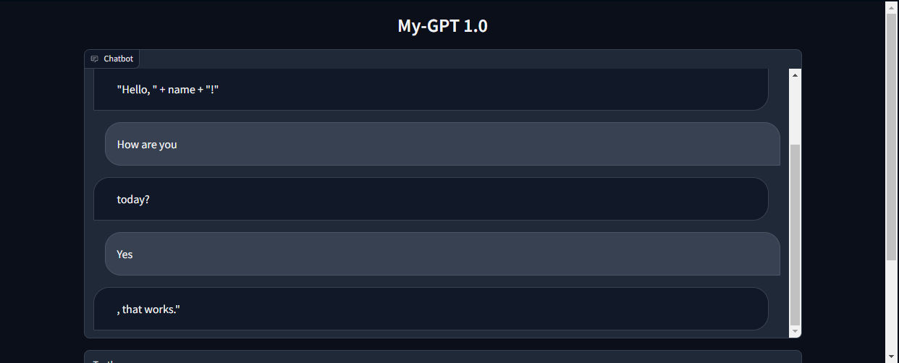

# My-GPT
An attempt to create a replica of ChatGPT

Large Language Models are foundation models that utilize deep learning in natural language processing and natural language generation tasks. Typically these models are trained on billions of parameters with a huge corpus of data.

GPT4all provides an ecosystem of open-source chatbots trained on massive collections of clean assistant data including code, stories and dialogue. GPT4All is a 7B parameter LLM trained using a Low-Rank Adaptation (LoRA) method, yielding 430k post-processed instances, on a vast curated corpus of over 800k high-quality assistant interactions.

Deployment steps:
1. Download the .ipynb or .py file
2. Download the required libraries as mentioned in the .txt file (also have Python 3.11 version installed)
3. Run the file, for .ipynb file run all the cells and for .py file in cmd type python test_app.py and enter
4. Volla you have your chat gpt ready
5. Add more blocks of functions to this code to make it look more customized and unique

